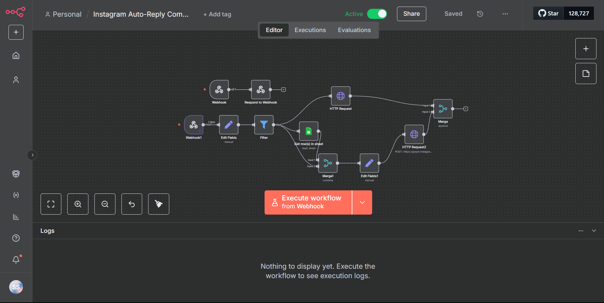

# 📩 Instagram Comment → DM Automation in n8n (ManyChat Alternative)

## 📌 Overview
This project is a **fully automated Instagram Comment → DM workflow** built entirely inside **n8n**, without relying on third-party chatbot tools like ManyChat.

It watches for **comments on a specific Instagram post**, extracts user details, and sends a **customized DM** based on the post or comment — while fully complying with Instagram’s API policies.

The system is **100% API-driven**, fully customizable, and **cost-efficient** — providing the same functionality as ManyChat **without paying for external tools**.

---

## 🎯 Features
- **Webhook Trigger** that activates only when a new comment is posted (not likes, edits, or other events).
- **Comment Parsing** to extract comment text, user ID, and contextual details.
- **Custom Direct Messaging** tailored to the specific post and user.
- **Instagram Policy Compliance** — works within the “user must message first” restriction using an **alternative API path**.
- **No Third-Party Dependencies** — built from scratch using native APIs.
- **Scalable** — can adapt for multiple posts or campaigns.

---

## 🛠️ Tech Stack
- **n8n** (Self-hosted automation platform)
- **Meta/Instagram Graph API**
- **Custom Webhooks**
- **REST API Calls**
- **Advanced Workflow Logic** (conditions, filters, mapping)

---

## 📡 API Discovery & Engineering
Creating this workflow was not straightforward:
1. **Webhook Challenges**  
   Instagram’s webhook events include multiple triggers (likes, edits, etc.). I engineered a filter to capture **only** fresh comments — preventing false triggers.
   
2. **DM Restrictions**  
   Instagram’s API doesn’t allow you to message a user unless they’ve messaged you first. I explored an **alternative API route** to enable compliant communication while keeping the experience seamless.

3. **ManyChat Alternative Logic**  
   ManyChat uses hidden APIs & infrastructure. I reverse-engineered the logic to replicate it **100% inside n8n** — giving my organization full control and removing recurring subscription costs.

---

## 🧠 Skills & Learnings
- **API Integration Mastery** — deep exploration of Meta’s Graph API documentation and hidden edge cases.
- **Workflow Engineering** — complex conditional flows to prevent unwanted messages.
- **Automation Without Third-Party Apps** — building ManyChat-like features in-house.
- **Cost Optimization** — eliminated paid external chatbot tools.

---

## 📂 Workflow Structure
1. **Instagram Webhook Node** — captures incoming comment data.
2. **Filter Node** — ensures only new comments are processed.
3. **HTTP Request Node** — fetches commenter’s user ID and post details.
4. **Custom DM Logic Node** — maps the post to the correct DM template.
5. **DM Send Node** — sends the message via the Instagram Graph API.

---

## 📈 Benefits to the Organization
- **Cost Savings** — Removed the need for paid tools like ManyChat.
- **Full Customization** — Modify triggers, messages, and post mappings anytime.
- **Data Ownership** — All user interactions are stored internally.

---

## 🔒 Privacy
While I cannot post a working video due to **organizational privacy policies**, you can check the code and workflow setup in this repository to understand its implementation.

---

## 🔗 Connect with Me
💼 [LinkedIn](linkedin.com/in/sankalpgaur/)  

